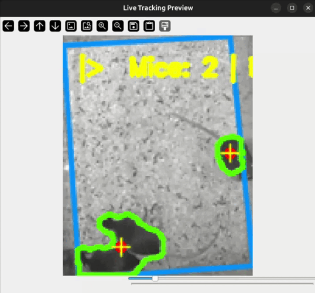

# taot - The Art Of Tracking

> taot is an automated tracking tool for mice in top-view enclosures using background subtraction.
> Designed for long recordings (up to 24 hours), with a batch processing queue and frame-by-frame CSV export all from a single interface.

<table>
<tr>
<td align="center"><b>Day conditions</b></td>
<td align="center"><b>Infrared conditions</b></td>
</tr>
<tr>
<td></td>
<td></td>
</tr>
</table>

## Table of Contents

- [Key features](#key-features)
- [Setup](#setup)
- [Documentation](#documentation)

---

## Key features

| Feature                    | Description                                                                                                                |
| -------------------------- | -------------------------------------------------------------------------------------------------------------------------- |
| **Batch processing queue** | Up to 4 videos processed in parallel from a single interface                                                               |
| **FFmpeg preprocessing**   | FPS reduction, automatic crop to ROI bounding box, spatial downscaling                                                     |
| **Global tracking**        | Detection and localization of dark blobs inside a 4-point polygonal ROI, frame-by-frame CSV export                         |
| **ROI intrusion detector** | Presence detection in a rectangular zone based on mean gray value, with temporal check and median-frame screenshot capture |
| **Live visualization**     | Interactive mode with navigation bar, pause, and frame-by-frame stepping for test purpose                                  |
| **GPU acceleration**       | NVENC encoding (Windows) or VAAPI (Linux), automatic CPU fallback on failure                                               |
| **JSON export**            | Automatic save of all parameters at the end of each batch for reproducibility                                              |

---

## Setup

Prerequisites: [Miniconda](https://docs.conda.io/en/latest/miniconda.html), a C++ compiler (`g++` on Linux, MSVC via Visual Studio Build Tools on Windows).

**1. Create the environment**

Linux or Windows (Anaconda Prompt):

```bash
conda env create -f environment.yml && conda activate taot
```

**2. Compile the C++ modules**

Linux:

```bash
export PKG_CONFIG_PATH=$CONDA_PREFIX/lib/pkgconfig
python src/build_cpp.py
```

Windows (Anaconda Prompt):

```cmd
set OPENCV_DIR=%CONDA_PREFIX%\Library
python src\build_cpp.py
```

**3. Launch**

```bash
python app.py
```

**4. Generate an Executable file**

```bash
pyinstaller taot_installer.spec
```

You may need [ffmpeg binary file](https://ffbinaries.com/downloads#version_6.1) to compile the executable, and place it inside the "lib" folder.

---

## Documentation

Full usage guide and parameter reference: [docs/tutorial.md](docs/tutorial.md)
