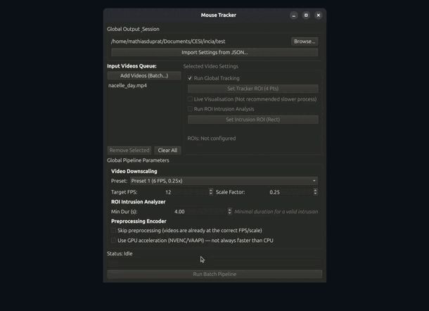
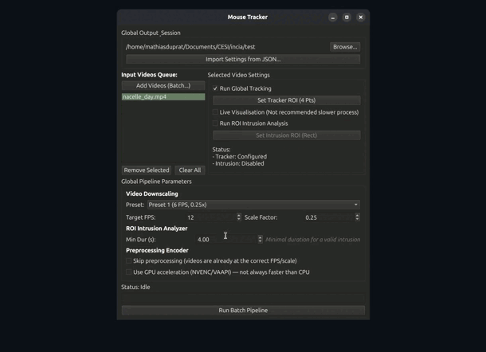
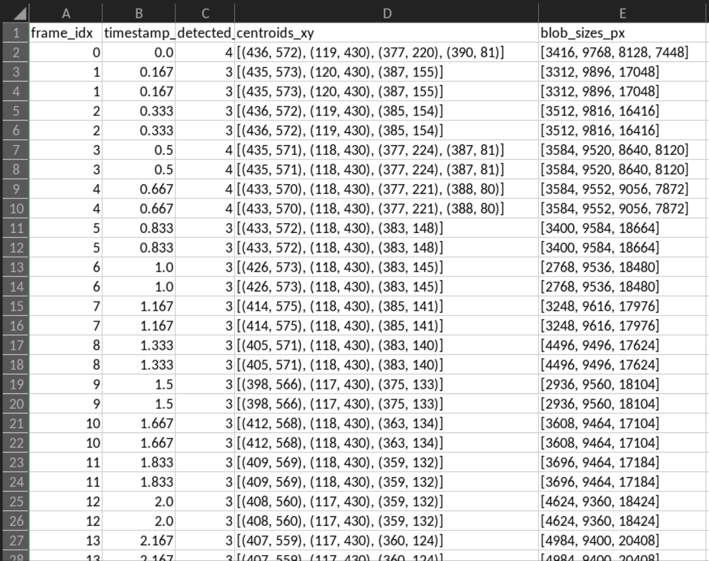
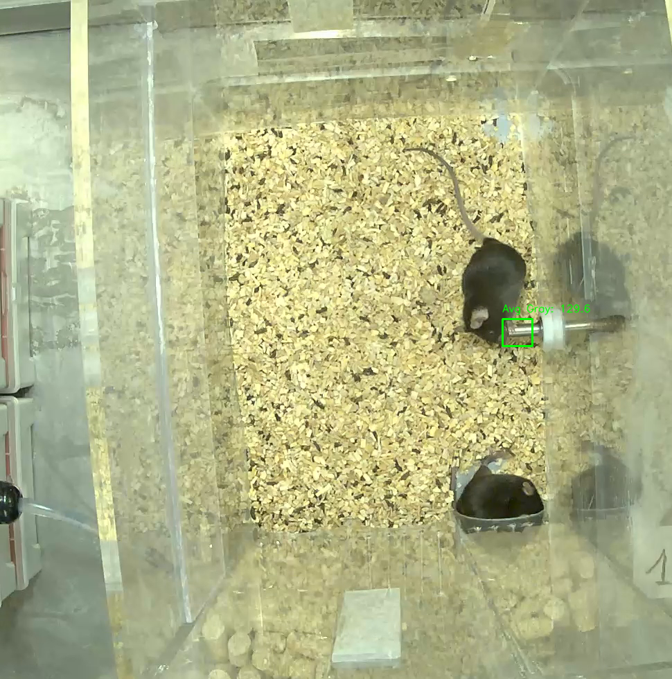

# Tutorial

## Table of Contents

- [1. Setup](#1-setup)
- [2. Configure each video](#2-configure-each-video)
- [3. Set pipeline parameters](#3-set-pipeline-parameters)
- [4. Run the batch](#4-run-the-batch)
- [Generated outputs](#generated-outputs)
- [Project architecture](#project-architecture)

---

## 1. Setup

**Output folder** : Click **"Browse"** in the _Global Output & Session_ section and choose an existing folder. The **"Run Batch Pipeline"** button stays disabled until a folder is set.

**Add videos** : Click **"Add Videos (Batch...)"** to select one or more video files (multi-select with Ctrl/Shift). They are added to the queue on the left.

---

## 2. Configure each video

Click a video in the queue to display its settings in the right panel. Tracking and intrusion detection can be configured independently per video.

### Global tracking

1. Check **"Run Global Tracking"**
2. Click **"Set Tracker ROI (4 Pts)"**
3. Click 4 points to define the arena boundary (the polygon can be non-rectangular)
4. Confirm by closing the window



### Intrusion detector

1. Check **"Run ROI Intrusion Analysis"**
2. Click **"Set Intrusion ROI (Rect)"**
3. Draw a rectangle by click-and-drag on the first frame
4. Confirm by closing the window



### Live visualization (optional)

Check **"Live Visualisation"** to watch the processing pipeline frame by frame.

Shortcuts: `Space` pause/resume · `A` previous frame · `D` next frame.

---

## 3. Set pipeline parameters

Preprocessing presets are applied globally to all videos:

| Preset   | FPS | Scale |
| -------- | --- | ----- |
| Preset 1 | 6   | 0.25× |
| Preset 2 | 24  | 0.50× |
| Preset 3 | 6   | 0.10× |
| Custom   | —   | —     |

- **Skip preprocessing** : use the video as-is (already preprocessed)
- **Use GPU** : enables NVENC (Windows) or VAAPI (Linux), with automatic CPU fallback on failure

> The gray threshold for the intrusion detector is set automatically by calibration (85th percentile of the gray value distribution over the ROI across the calibration window).

---

## 4. Run the batch

Click **"Run Batch Pipeline"**. Videos are processed in parallel (up to 4 at a time). Logs appear in real time in the status area. A `settings_YYYYMMDD_HHMMSS.json` file is saved in the output folder at the end.

---

## Generated outputs

For each video `session_01.mp4`, the output folder contains:

```
output/
└── session_01/
    ├── session_01_6fps_0p25x.mp4                        # Preprocessed video
    ├── session_01_20250622_143012_data.csv               # Frame-by-frame tracking
    ├── session_01_resume.csv                             # Hourly summary
    ├── roi_intrusion_session_01_20250622_143012/
    │   ├── roi_intrusion_data.csv                        # Presence sessions table
    │   ├── session_frame_00123_median.png                # Median-frame screenshots
    │   └── ...
    └── settings_20250622_143012.json                     # Full parameters export
```

### Tracking CSV (`_YYYYMMDD_HHMMSS_data.csv`)

| Column                 | Description                                     |
| ---------------------- | ----------------------------------------------- |
| `frame_idx`            | Frame index                                     |
| `timestamp_sec`        | Timestamp in seconds                            |
| `detected_blobs_count` | Number of detected blobs                        |
| `centroids_xy`         | List of `(x, y)` tuples in original coordinates |
| `blob_sizes_px`        | Area of each blob in px² (original resolution)  |



### Intrusion CSV (`roi_intrusion_data.csv`)

| Column             | Description                         |
| ------------------ | ----------------------------------- |
| `start_frame`      | Session start frame                 |
| `end_frame`        | Session end frame                   |
| `duration_seconds` | Total duration in seconds           |
| `avg_gray`         | Mean gray value at the median frame |
| `screenshot_path`  | Path to the median-frame screenshot |

For each detected intrusion session, a median-frame screenshot is saved at the midpoint of the session.



---

## Project architecture

### Overview

```
app.py  (MainWindow - PyQt6)
│
├── ui/roi_window.py          RectRoiDialog / PolygonRoiDialog
│
└── src/
    ├── batch_handler.py      BatchProcessorThread  (QThread + ThreadPoolExecutor)
    │   ├── video_preprocessor.py     Step 1 FFmpeg resampling
    │   ├── global_tracker.py         Step 2 background subtraction tracking
    │   │   └── global_tracker_core   (C++ pybind11 extension)
    │   ├── roi_intrusion_detector.py Step 3 ROI presence/light detection
    │   │   └── roi_intrusion_detector_core  (C++ pybind11 extension)
    │   └── video_summarizer.py       Step 4 hourly CSV aggregation
    └── build_cpp.py          C++ extension build script
```

### UI layer - `app.py`

`MainWindow` is the main PyQt6 window. It manages:

- the video queue (`videos_data`, list of dicts),
- per-video ROIs (4-point polygon for the tracker, rectangle for intrusion),
- global parameters (FPS, scale factor, GPU, minimum duration),
- full session import/export via a `settings_*.json` file.

At batch start, `MainWindow` computes the scaled ROIs, locks the interface, then instantiates a `BatchProcessorThread` and connects to it via Qt signals.

### Orchestration - `batch_handler.py`

`BatchProcessorThread` inherits from `QThread` and runs outside the main thread. It splits the queue into two groups:

- **normal videos** - processed in parallel inside a `ThreadPoolExecutor` (up to 4 workers, I/O-bound),
- **live-view videos** - processed sequentially after the batch (`cv2.imshow` requires the main thread and is delegated via `live_view_signal`).

Signals emitted to the UI:

| Signal                                   | Role                                   |
| ---------------------------------------- | -------------------------------------- |
| `progress_signal(int)`                   | Overall progress percentage            |
| `log_signal(str)`                        | Message displayed in the status bar    |
| `error_signal(str)`                      | Blocking error shown in a dialog       |
| `finished_signal()`                      | Normal batch completion                |
| `live_view_signal(str, str, str, float)` | Delegates live mode to the main thread |

### Per-video pipeline

#### Step 1 Preprocessing (`video_preprocessor.py`)

Calls FFmpeg as a subprocess to crop the video to the bounding box of the 4-point ROI, then reduces it to the target FPS and scale factor. Supports GPU acceleration via NVENC (Windows) or VAAPI (Linux), with automatic fallback to `libx264` on failure.

#### Step 2 Global tracking (`global_tracker.py` + `global_tracker_core.cpp`)

Implements a background-subtraction tracker with grayscale thresholding (fixed threshold `MANUAL_DARK_THRESH = 72`). The `FrameEngine` compiled in C++ via pybind11 processes each frame to extract blobs (filtered to `MIN_BLOB_AREA = 90 px²`). Centroid coordinates are mapped back to the original resolution before being written to the tracking CSV.

In live-view mode, an alternative Python backend (`_run_live_tracking`) displays the pipeline frame by frame in an OpenCV window with pause/step controls.

#### Step 3 Intrusion detection (`roi_intrusion_detector.py` + `roi_intrusion_detector_core.cpp`)

Detects animal presence sessions in a rectangular ROI using an adaptive threshold: the P85 of the last mean gray values (calibration window, default 3000 frames). The C++ extension handles the per-frame logic; the Python wrapper validates sessions (duration ≥ `min_duration`) and saves median-frame screenshots from the original high-resolution video.

#### Step 4 Hourly summary (`video_summarizer.py`)

Aggregates the tracking CSV into hourly slices. Computes for each hour the mean blob area and, if an intrusion CSV is provided, the corresponding presence metrics.

### C++ extensions (pybind11)

Both native modules (`global_tracker_core`, `roi_intrusion_detector_core`) are compiled with `build_cpp.py` and loaded at startup. The application fails explicitly at startup if a module is missing, rather than crashing silently on the first processed frame.
